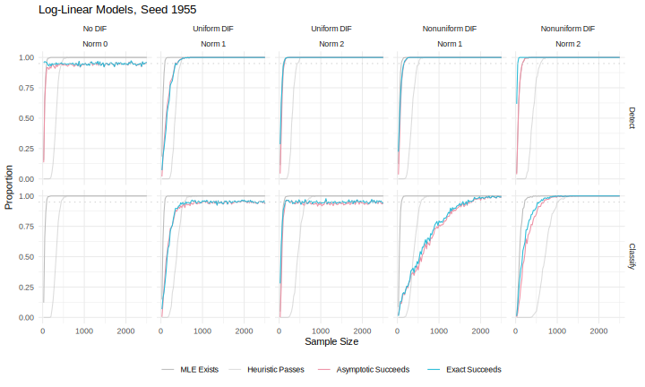
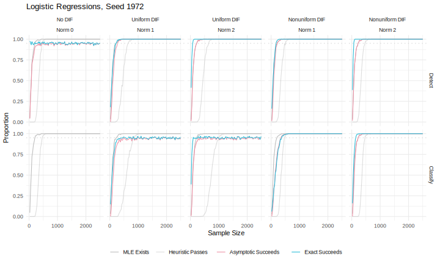
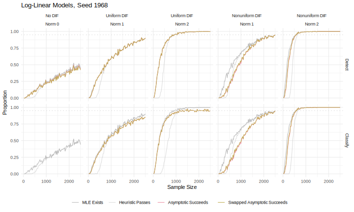
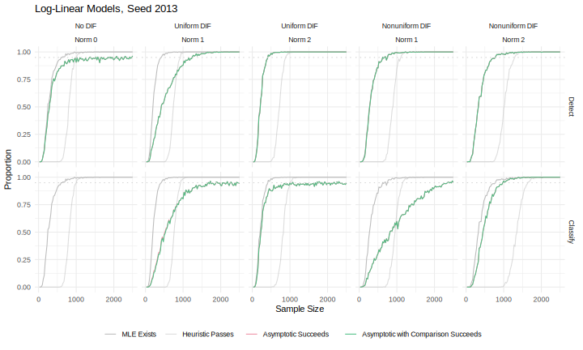

<!-- 
Do not edit README.md in the root directory of this repository! 

This file is generated using:

* source/README.md for the text and structure, and 
* source/sim-plot.R for the tables of plots. 

To make changes, edit the above instead. 
-->

# Using Algebraic Statistics for DIF Analysis

This repository contains supplementary materials for the paper:

Shishir Agrawal, Luis David Garcia Puente, Minho Kim, and Flavia Sancier-Barbosa: *Using Exact Tests from Algebraic Statistics in Sparse Multi-way Analyses: An Application to Analyzing Differential Item Functioning*. 

arXiv: [TBA]. 

## Source

The `source` directory contains the following files:   

* `base.R` is an assortment of functions related to conducting DIF analysis using classical asymptotics and using algebraic statistics. Functions in this file are invoked by most of the following R script files. 
    - `seeds.csv` contains a list of 16 integer seeds. 
    - `models.rds` contains data about the models generated from these seeds (via the `generate_simulation_models` function in `base.R`). 
* `hci.R` conducts DIF analysis on the HCI dataset as explained in the paper. 
    - `hci-moves6.rds` and `hci-moves9.rds` contain Markov move computations that are used in `hci.R`.
* `heat.R` generates a heat map of Kullback-Leibler divergences for dichotomous seeds. See below. 
* `sim-run.R` runs parallelized simulations under a variety of sample size and DIF configurations. 
    - `results.zip` is a compressed CSV of the results of `sim-run.R`. See below. 
    - `sim-plot.R` generates many plots (and tables to organize the plots) out of the results of `sim-run.R`. See below.  

Note that the `rds` files are not necessary in the sense that, if they are missing, the data they contain will be computed on the fly and the files will be created. This will increase running time because these files contain results of Markov move computations. 

## Kullback-Leibler Heat Map

The following visualization is generated by `heat.R`. An explanation follows; for notation, see "Methods" in the paper.

Facet labels are the 8 seeds in `seeds.csv` which produce dichotomous models. Each of these seeds determines a joint distribution of `(A, G)` and a unit vector `(u_0, v_0)` which determines the distribution of responses in group 0, and the plane depicted in each facet above is the two-dimensional space `(C^\perp)^2` of DIF vectors `(u_\Delta, v_\Delta)` for that seed. For each DIF vector, we compute the resulting joint distribution of `(A, G, R)`, and then we compute the maximum, over `a \in \mathscr{A}`, of the Kullback-Leibler divergence from the distribution of responses among subjects of ability `a` in group 0 to the same in group 1 ("KL"). 

Each seed also chooses two DIF vectors of unit length, one uniform and one nonuniform. These vectors are depicted in black above. The uniform one always points directly up or down, while the nonuniform one is generic. (Note that the two vectors are almost identical for seed 1930, which is why classification of nonuniform DIF is particularly difficult for this seed.)

The vector `(u_0, v_0)` chosen by the seed also lives in `(C^\perp)^2`, but not the same copy of `(C^\perp)^2` in which DIF vectors live, so it technically does not belong in this picture. Nonetheless, we depict it as a shadowy gray vector (scaled down by a factor of 2) in the visualization above. 

## Simulation Data

There are 33 columns and 4,000,000 rows (plus 1 for column headers) in the CSV file found inside `source/results.zip`. Each row corresponding to one simulated table. For each table, we record the following 33 pieces of information: 

* `seed`: the seed that was used to generate the table.
* `type`: the type of the DIF vector that was used to generate the table.
* `norm`: the norm of the DIF vector that was used to generate the table.
* `sample_size`: the total number of observations in the table. 
* `has_no_zeros`: whether the table had any sampling zeros. 
* `llm_asy_no23_mle`: whether the MLE for the log-linear conditional independence model exists.
* `llm_asy_no23_heuristic`: whether at least 80\% of the expected counts under the log-linear conditional independence model are at least 5.
* `llm_asy_no3w_mle`: whether the MLE for the log-linear homogeneous association model exists.
* `llm_asy_no3w_heuristic`: whether at least 80\% of the expected counts under the log-linear homogeneous association model are at least 5.
* `llm_asy_no23_p`: the asymptotic p-value for the fit of the log-linear conditional independence model.
* `llm_asy_no3w_p`: the asymptotic p-value for the fit of the log-linear homogeneous association model.
* `llm_asy_comp_p`: the asymptotic p-value for the comparison of fit between the log-linear conditional independence and homogeneous association models.
* `llm_exc_no23_p`: the exact p-value for the fit of the log-linear conditional independence model.
* `llm_exc_no3w_p`: the exact p-value for the fit of the log-linear homogeneous association model. 
* `llm_asy_main`: the result of the DIF test using log-linear models and the asymptotic strategy.
* `llm_asy_comp`: the result of the DIF test using log-linear models, the asymptotic strategy, and the variant of the paradigm where the classification is augmented with a comparison-of-fit test. 
* `llm_asy_swap`: the result of the DIF test using log-linear models, the asymptotic strategy, and the variant of the paradigm where the goodness-of-fit tests are swapped. 
* `llm_exc_main`: the result of the DIF test using log-linear models and the exact strategy.
* `llm_exc_swap`: the result of the DIF test using log-linear models, the exact strategy, and the variant of the paradigm where the goodness-of-fit tests are swapped. 
* `lrm_asy_no23_mle`: whether the MLE for the logistic regressions conditional independence model exists.
* `lrm_asy_no23_heuristic`: whether at least 80\% of the expected counts under the logistic regressions conditional independence model are at least 5.
* `lrm_asy_no3w_mle`: whether the MLE for the logistic regressions homogeneous association model exists.
* `lrm_asy_no3w_heuristic`: whether at least 80\% of the expected counts under the logistic regressions homogeneous association model are at least 5.
* `lrm_asy_no23_p`: the asymptotic p-value for the fit of the logistic regressions conditional independence model.
* `lrm_asy_no3w_p`: the asymptotic p-value for the fit of the logistic regressions homogeneous association model.
* `lrm_asy_comp_p`: the asymptotic p-value for the comparison of fit between the logistic regressions conditional independence and homogeneous association models.
* `lrm_exc_no23_p`: the exact p-value for the fit of the logistic regressions conditional independence model.
* `lrm_exc_no3w_p`: the exact p-value for the fit of the logistic regressions homogeneous association model. 
* `lrm_asy_main`: the result of the DIF test using logistic regressions and the asymptotic strategy.
* `lrm_asy_comp`: the result of the DIF test using logistic regressions, the asymptotic strategy, and the variant of the paradigm where the classification is augmented with a comparison-of-fit test. 
* `lrm_asy_swap`: the result of the DIF test using logistic regressions, the asymptotic strategy, and the variant of the paradigm where the goodness-of-fit tests are swapped. 
* `lrm_exc_main`: the result of the DIF test using logistic regressions and the exact strategy.
* `lrm_exc_swap`: the result of the DIF test using logistic regressions, the exact strategy, and the variant of the paradigm where the goodness-of-fit tests are swapped. 

Some plots to help visualize this data appear below. 

### Primary Comparison Plots

The following plots compare the asymptotic and exact strategies of DIF analysis. Log-linear models were used on every table, but logistic regressions were used only on every dichotomous table. The plots are structured like the ones that appear in the paper; see "Results" for a description. 

Right-click and open image in new tab to zoom. 

<table>
<tr> <th align="center"> Seed </th> <th align="center"> Log-Linear Models </th> <th align="center"> Logistic Regressions </th>  </tr>
<tr> <td align="center"> 1789 </td> <td align="center">  </td> <td align="center">  </td> </tr>
<tr> <td align="center"> 1795 </td> <td align="center">  </td> <td align="center">  </td> </tr>
<tr> <td align="center"> 1848 </td> <td align="center">  </td> <td align="center">  </td> </tr>
<tr> <td align="center"> 1919 </td> <td align="center">  </td> <td align="center">  </td> </tr>
<tr> <td align="center"> 1930 </td> <td align="center">  </td> <td align="center">  </td> </tr>
<tr> <td align="center"> 1945 </td> <td align="center">  </td> <td align="center">  </td> </tr>
<tr> <td align="center"> 1947 </td> <td align="center">  </td> <td align="center">  </td> </tr>
<tr> <td align="center"> 1948 </td> <td align="center">  </td> <td align="center">  </td> </tr>
<tr> <td align="center"> 1955 </td> <td align="center">  </td> <td align="center">  </td> </tr>
<tr> <td align="center"> 1963 </td> <td align="center">  </td> <td align="center">  </td> </tr>
<tr> <td align="center"> 1968 </td> <td align="center">  </td> <td align="center">  </td> </tr>
<tr> <td align="center"> 1972 </td> <td align="center">  </td> <td align="center">  </td> </tr>
<tr> <td align="center"> 1997 </td> <td align="center">  </td> <td align="center">  </td> </tr>
<tr> <td align="center"> 2011 </td> <td align="center">  </td> <td align="center">  </td> </tr>
<tr> <td align="center"> 2013 </td> <td align="center">  </td> <td align="center">  </td> </tr>
<tr> <td align="center"> 2015 </td> <td align="center">  </td> <td align="center">  </td> </tr>
</table>

### Secondary Comparison Plots

The following plots compare the DIF analysis paradigm that we focus on in the paper against two of the variants discussed there: the variant where the order of goodness-of-fit tests is swapped using both the asymptotic ("Asy") and the exact ("Exc") strategies, and the variant where classification step is augmented with a comparison ("Comp"), using only the asymptotic strategy.

Right-click and open image in new tab to zoom. 

<table>
<tr> <th rowspan=2> Seed </th> <th colspan=3> Log-Linear Models </th> <th colspan=3> Logistic Regressions </th> </tr>
<tr>  <th align="center"> Asy Swap </th> <th align="center"> Exc Swap </th> <th align="center"> Asy Comp </th> <th align="center"> Asy Swap </th> <th align="center"> Exc Swap </th> <th align="center"> Asy Comp </th>  </tr>
<tr> <td align="center"> 1789 </td> <td align="center">  </td> <td align="center">  </td> <td align="center">  </td> <td align="center">  </td> <td align="center">  </td> <td align="center">  </td> </tr>
<tr> <td align="center"> 1795 </td> <td align="center">  </td> <td align="center">  </td> <td align="center">  </td> <td align="center">  </td> <td align="center">  </td> <td align="center">  </td> </tr>
<tr> <td align="center"> 1848 </td> <td align="center">  </td> <td align="center">  </td> <td align="center">  </td> <td align="center">  </td> <td align="center">  </td> <td align="center">  </td> </tr>
<tr> <td align="center"> 1919 </td> <td align="center">  </td> <td align="center">  </td> <td align="center">  </td> <td align="center">  </td> <td align="center">  </td> <td align="center">  </td> </tr>
<tr> <td align="center"> 1930 </td> <td align="center">  </td> <td align="center">  </td> <td align="center">  </td> <td align="center">  </td> <td align="center">  </td> <td align="center">  </td> </tr>
<tr> <td align="center"> 1945 </td> <td align="center">  </td> <td align="center">  </td> <td align="center">  </td> <td align="center">  </td> <td align="center">  </td> <td align="center">  </td> </tr>
<tr> <td align="center"> 1947 </td> <td align="center">  </td> <td align="center">  </td> <td align="center">  </td> <td align="center">  </td> <td align="center">  </td> <td align="center">  </td> </tr>
<tr> <td align="center"> 1948 </td> <td align="center">  </td> <td align="center">  </td> <td align="center">  </td> <td align="center">  </td> <td align="center">  </td> <td align="center">  </td> </tr>
<tr> <td align="center"> 1955 </td> <td align="center">  </td> <td align="center">  </td> <td align="center">  </td> <td align="center">  </td> <td align="center">  </td> <td align="center">  </td> </tr>
<tr> <td align="center"> 1963 </td> <td align="center">  </td> <td align="center">  </td> <td align="center">  </td> <td align="center">  </td> <td align="center">  </td> <td align="center">  </td> </tr>
<tr> <td align="center"> 1968 </td> <td align="center">  </td> <td align="center">  </td> <td align="center">  </td> <td align="center">  </td> <td align="center">  </td> <td align="center">  </td> </tr>
<tr> <td align="center"> 1972 </td> <td align="center">  </td> <td align="center">  </td> <td align="center">  </td> <td align="center">  </td> <td align="center">  </td> <td align="center">  </td> </tr>
<tr> <td align="center"> 1997 </td> <td align="center">  </td> <td align="center">  </td> <td align="center">  </td> <td align="center">  </td> <td align="center">  </td> <td align="center">  </td> </tr>
<tr> <td align="center"> 2011 </td> <td align="center">  </td> <td align="center">  </td> <td align="center">  </td> <td align="center">  </td> <td align="center">  </td> <td align="center">  </td> </tr>
<tr> <td align="center"> 2013 </td> <td align="center">  </td> <td align="center">  </td> <td align="center">  </td> <td align="center">  </td> <td align="center">  </td> <td align="center">  </td> </tr>
<tr> <td align="center"> 2015 </td> <td align="center">  </td> <td align="center">  </td> <td align="center">  </td> <td align="center">  </td> <td align="center">  </td> <td align="center">  </td> </tr>
</table>

## Licenses

For code in this repository: [GPL-3.0-only](https://www.gnu.org/licenses/gpl-3.0.txt).

For all other content in this repository: [CC BY-SA 4.0](https://creativecommons.org/licenses/by-sa/4.0/).

